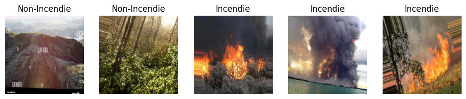
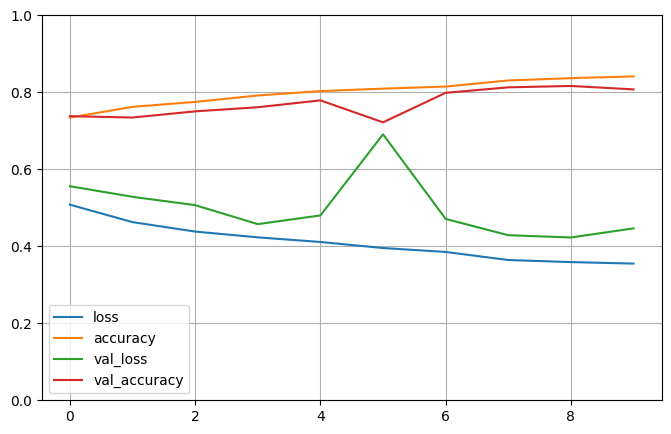
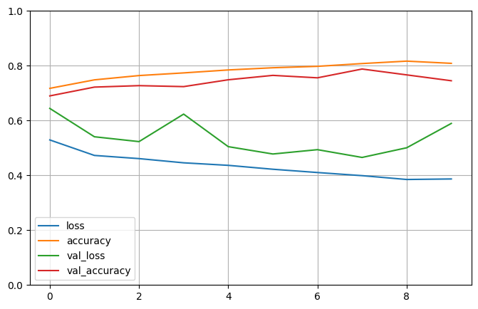
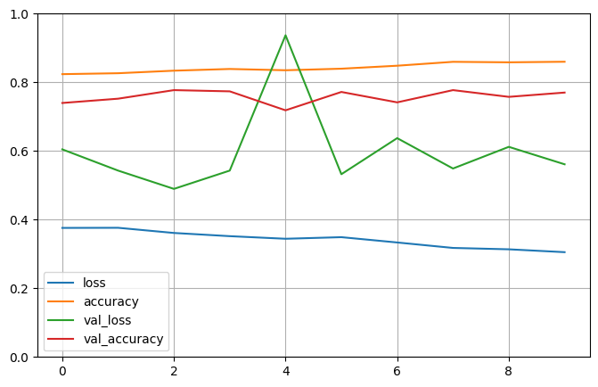

<h1> Classification d'images d'incendies</h1>

### BOUEDO THEO & DORE CORALIE
**Date :** 01/12/2023

&nbsp;

&nbsp;
### Table of Contents
[**I. Introduction**](#i-introduction) 

[**II. Gestion & analyse de la base**](#ii-gestion--analyse-de-la-base) 
&nbsp;&nbsp;&nbsp;&nbsp;[A. Importation et nettoyage](#a-importation-et-nettoyage) 
&nbsp;&nbsp;&nbsp;&nbsp;[B. Analyse et transformation](#b-analyse-et-transformation) 

[**III. Évaluation de Modèles et optimisation**](#iii-évaluation-de-modèles-et-optimisation) 
&nbsp;&nbsp;&nbsp;&nbsp;[A. Modèle CNN](#a-modèle-cnn) 
&nbsp;&nbsp;&nbsp;&nbsp;[B. Modèle CNN avec CLAHE](#b-modèle-cnn-avec-clahe) 
&nbsp;&nbsp;&nbsp;&nbsp;[C. Modèle CNN avec transfert d'apprentissage](#c-modèle-cnn-avec-transfert-dapprentissage) 
&nbsp;&nbsp;&nbsp;&nbsp;[D. Modèle SVM](#d-modèle-svm) 

[**IV. Conclusion / Discussion**](#iv-conclusion--discussion) 

## I. Introduction
L'analyse d'image par intelligence artificielle est un domaine en pleine expansion, particulièrement dans la détection d'événements critiques tels que les incendies. Dans ce projet, nous avons exploré l'efficacité des réseaux de neurones convolutifs (CNN) pour identifier la présence d'incendie dans des images. Nous avons testé quatre approches différentes : un modèle CNN standard, un CNN combiné avec l'Algorithme de CLAHE pour l'amélioration du contraste, un CNN amélioré par transfert d'apprentissage et enfin, une approche basée sur une Machine à Vecteurs de Support (SVM) pour la classification après l'extraction des caractéristiques. L'objectif principal était de déterminer si chaque image analysée représentait un incendie, en exploitant la puissance du traitement d'image et de l'apprentissage automatique.

## II. Gestion & analyse de la base
### A. Importation et nettoyage
####  Importation

Le jeu de données utilisé pour ce projet a été obtenu depuis le site de Hugging Face, accessible via le lien suivant : https://huggingface.co/datasets/pyronear/openfire. Initialement, ce jeu de données se compose de deux ensembles distincts : un ensemble d'entraînement (train) et un ensemble de validation (validation), chacun comprenant une colonne avec l'URL des images et une autre indiquant par un booléen (`is_wildfire`) si l'image représente un incendie ou non.

La première étape du projet consistait à télécharger ces images, tâche réalisée à l'aide de la bibliothèque `requests`. Les deux ensembles de données comprenaient à l'origine environ 8000 URL d'images, et le processus de téléchargement a duré près de 2 heures.

Pour différencier les images appartenant aux ensembles d'entraînement et de validation, ainsi que celles représentant des incendies de celles qui n'en représentent pas, le projet a suivi l'architecture présentée dans l'image ci-dessous.

#### Suppression des images corrompues
Des problèmes ont été rencontrés lors de la phase de téléchargement, notamment la disparition de certains liens, rendant impossible le téléchargement de certaines images, ainsi que la présence d'images corrompues. Une fonction spécifique a été développée pour détecter et supprimer ces images corrompues des dossiers du projet.

### B. Analyse et transformation

#### Analyse
En raison de la disparition de certains liens et de la présence d'images corrompues, une proportion significative des images a été retirée, résultant en une différence notable entre le dataset initial et le dataset final. La `Table 1` illustre cette évolution, offrant un aperçu détaillé de la distribution des datasets d'entraînement et de validation, ainsi que de la classification des images en 'incendie' et 'non-incendie'.

Nous observons qu'entre les datasets initiaux et finaux, il y a eu une perte de 20 à 25% du volume total d'images. Cette diminution est uniforme, affectant de manière équivalente les deux ensembles de données et les deux catégories d'images.

Quant à la répartition entre les images représentant des incendies et celles n'en représentant pas, le ratio final de 65% pour les images 'non-incendie' contre 35% pour celles 'incendie' est intéressant. Une telle distribution fournit un équilibre adéquat entre les classes, essentiel pour éviter les biais dans l'entraînement des modèles de machine learning.

En ce qui concerne la répartition entre les ensembles d'entraînement et de validation, avec un peu plus de 10% des images allouées à la validation, ce ratio est conforme aux recommandations standards en data science. 

#### Table 1 : Comparaison des ensembles de données initiaux et finaux pour la détection d'incendie
|                  | DATASET INITIAL |                | DATASET FINAL   |                |
|------------------|-----------------|----------------|-----------------|----------------|
| Dataset          | Train           | Validation     | Train           | Validation     |
| Incendie         | 2518            | 279            | 1981            | 229            |
| Non-Incendie     | 4625            | 513            | 3444            | 425            |
| Total            | 7143            | 792            | 5425            | 654            |
| % Incendie       | 35.25          | 35.23         | 36.52          | 35.02         |
| % Non-Incendie   | 64.75          | 64.77         | 63.48          | 64.98         |

#### Transformation

Lors de l'examen des images, nous avons remarqué une variabilité dans leurs dimensions. Pour uniformiser ces différences, une transformation a été appliquée pour `redimensionner` toutes les images à une taille commune de `128x128`. Ce choix de dimension a été guidé par le fait que des images de grande taille augmentent le temps de calcul.

Pour enrichir notre ensemble de données, nous avons utilisé `ImageDataGenerator` de la bibliothèque `keras.preprocessing.image`. L'objectif principal de cette démarche est de créer une variété d'exemples d'apprentissage pour renforcer la capacité du modèle à généraliser. Cette technique est pertinente car elle permet au modèle de s'habituer à diverses transformations que les images peuvent subir dans des situations réelles.

L'utilisation de la fonctionnalité `rescale` est importante car elle `normalise` les valeurs des pixels, les amenant dans un intervalle compris entre 0 et 1, ce qui est optimal pour le traitement par les modèles d'apprentissage profond. De plus, l'application de `rotations, de zooms et de décalages aléatoires` simule différentes perspectives et échelles que les images pourraient présenter, ce qui contribue à renforcer la `robustesse` du modèle face à des variations inattendues dans les données d'entrée.

En résumé, `ImageDataGenerator` ne se limite pas à augmenter le volume des données, mais améliore également la qualité de l'apprentissage en exposant le modèle à un large éventail de variations possibles des images.

## III. Évaluation de Modèles

Pour nos modèles de réseaux de neurones convolutifs (CNN), nous avons systématiquement fixé le nombre d'époques à 10 en raison des contraintes de temps de calcul.  Nous n'avons pas procédé à un ajustement fin des hyperparamètres pour ces modèles (CNN et SVM), cependant, il est important de noter que nous avons inclus des étapes d'optimisation dans le notebook pour démontrer la procédure, même si ces étapes n'ont pas été poussées à leur terme pour les raisons mentionnées.

### A. Modèle CNN 
Afin de fournir une compréhension claire et structurée de notre modèle de détection d'incendie, nous avons résumé ses caractéristiques principales dans la table ci dessous.
 

#### Table 2 : Paramètres du Modèle de Détection d'Incendie CNN

| Couche             | Filtres | Taille du filtre | Activation | Input Shape       | Opération        |
|--------------------|---------|------------------|------------|-------------------|------------------|
| Conv2D (couche 1)  | 16      | 3 x 3            | ReLU       | (128, 128, 3)     | Convolution      |
| MaxPooling2D (1)   | -       | 2 x 2            | -          | -                 | Max Pooling      |
| Conv2D (couche 2)  | 32      | 3 x 3            | ReLU       | -                 | Convolution      |
| MaxPooling2D (2)   | -       | 2 x 2            | -          | -                 | Max Pooling      |
| Conv2D (couche 3)  | 64      | 3 x 3            | ReLU       | -                 | Convolution      |
| MaxPooling2D (3)   | -       | 2 x 2            | -          | -                 | Max Pooling      |
| Flatten            | -       | -                | -          | -                 | Aplatir          |
| Dense (couche 4)   | -       | -                | ReLU       | -                 | Couche Complètement Connectée |
| Dense (couche 5)   | -       | -                | Sigmoid    | -                 | Couche de Sortie |

&nbsp;

Notre modèle de détection d'incendie utilise des couches `Conv2D` pour capturer une gamme de caractéristiques visuelles à partir d'images, en commençant par des éléments simples comme les bords et les textures à des détails plus complexes grâce à l'augmentation du nombre de filtres de 16 à 64 à travers les couches successives. La fonction d'activation ReLU accompagne chaque couche convolutive pour apporter la non-linéarité nécessaire, permettant ainsi au modèle d'apprendre des motifs visuels plus complexes inhérents aux images d'incendie. 

Les couches `MaxPooling2D` interviennent pour réduire les dimensions des caractéristiques apprises, ce qui aide à minimiser le surajustement et permet au modèle d'être robuste face à la variabilité de la position et de l'échelle des incendies dans différentes images. Après les couches de convolution et de pooling, la fonction `Flatten` transforme les caractéristiques en un vecteur unique pour faciliter la classification par les couches denses suivantes, qui synthétisent ces caractéristiques en informations de haut niveau. En fin de compte, la couche de sortie utilise une activation sigmoïde pour prédire la probabilité qu'une image donnée contienne un incendie, fournissant ainsi une classification binaire claire.

#### Figure 1 : Évolution de la perte et de la précision durant l'entraînement et la validation du CNN

Le graphique ci-dessus révèle un modèle CNN qui démontre une amélioration graduelle de la précision d'entraînement, avec un accroissement de celle-ci d'environ 80% à 85% au cours des époques, ce qui témoigne d'une capacité accrue à classer avec exactitude les images d'incendie dans l'ensemble d'entraînement. Concernant l'ensemble de validation, la précision atteint un sommet de près de 78% avant de connaître des variations, reflétant une certaine instabilité dans la généralisation du modèle. Bien que l'on observe une volatilité dans la précision et une légère remontée de la perte de validation à un moment donné, ces indicateurs ne sont pas nécessairement synonymes d'un surajustement marqué. Le modèle semble conserver une performance de généralisation adéquate jusqu'à la neuvième époque, avec une précision de validation au-dessus de 81%. 

### B. Modèle CNN avec CLAHE

`CLAHE` est une méthode d'ajustement du contraste qui affine de manière ciblée l'éclairage dans des zones spécifiques d'une image, un avantage notable pour mettre en évidence les détails dans des régions sombres ou inégalement éclairées, comme on peut en rencontrer dans les images d'incendie. Une image en couleur se compose de trois canaux principaux — rouge, vert et bleu (RGB) — qui, combinés, forment la gamme complète des couleurs perçues. Dans notre cas, nous avons appliqué CLAHE uniquement sur le canal de luminance (L), et non sur les canaux de couleur. Cette approche se concentre sur l'amélioration de la visibilité des structures et formes en améliorant le contraste, tout en préservant les informations de couleur originales, ce qui est crucial pour identifier avec précision les incendies dans les images où la luminosité peut être  un indicateur clé.

Concernant les paramètres du modèle, nous avons garder les mêmes que le modèle précédent.

#### Figure 2 :  Évolution de la perte et de la précision durant l'entraînement et la validation du CNN avec CLAHE

A travers le graphique ci dessus nous constatons que le modèle CNN avec CLAHE présente une précision d'entraînement qui s'améliore de manière constante, ce qui laisse penser à un affinement dans la reconnaissance des images d'incendie. Toutefois, la précision de validation pour ce modèle se stabilise autour de 0.77, ce qui est légèrement inférieur à la précision de validation proche de 0.81 observée pour le modèle CNN sans CLAHE. Bien que l'application de CLAHE ait potentiellement réduit la volatilité de la précision de validation, cela ne s'est pas traduit par une augmentation significative de la précision globale sur l'ensemble de validation dans ce cas précis. 

### C. Modèle CNN avec transfert d'apprentissage

Le principe du transfert d'apprentissage repose sur l'idée que les connaissances acquises par un modèle lors de l'apprentissage d'une tâche peuvent être transférées et réutilisées pour une autre tâche connexe. C'est une approche puissante en apprentissage profond, car elle permet d'exploiter des modèles préalablement entraînés sur de vastes ensembles de données, comme ImageNet, qui ont déjà appris à identifier des caractéristiques et des motifs visuels complexes. Ce processus est avantageux car il évite de repartir de zéro pour l'apprentissage, ce qui nécessiterait des ressources considérables en termes de données, de temps et de puissance de calcul.

Les avantages du transfert d'apprentissage sont multiples. Il offre une amélioration significative du temps d'entraînement puisque le modèle initial a déjà une connaissance préliminaire des caractéristiques générales des images. De plus, il peut aussi améliorer la performance du modèle sur la nouvelle tâche, surtout lorsque les données disponibles sont limitées ou lorsque l'on dispose de moyens de calcul restreints.

Dans notre cas spécifique, nous avons choisi d'implémenter le transfert d'apprentissage avec EfficientNetB0 pour notre projet de détection d'incendie. Ce modèle est reconnu pour son efficacité, capable de fournir de bons résultats tout en étant moins gourmand en ressources de calcul que d'autres architectures. Malgré le fait qu'EfficientNetB0 a été entraîné sur des images de résolution plus élevée (224x224 pixels), nous avons décidé de conserver une résolution de 128x128 pixels pour garder la même résolution entre les modèles afin de les comparer. 

*Ps : On aurait aimé tester tous les modèles en résolution 224x224 pour évaluer pleinement le potentiel de cette méthode, mais la réexécution des modèles étant assez chronophage, environ 1 heure par modèle, nous avons pas entrepris cette démarche.*

#### Figure 3 : Évolution de la perte et de la précision durant l'entraînement et la validation du CNN avec EfficientNetB0

La stabilité de la précision du modèle est comparable à celle observée avec l'utilisation de CLAHE, avoisinant les 0.77. Cependant, à la différence des autres modèles, celui-ci montre une progression moindre et un écart plus marqué entre la précision d'entraînement et de validation, indiquant un surajustement plus prononcé que dans les cas précédents.

### D. Modèle SVM

L'approche SVM (Support Vector Machine) pour l'analyse d'images se distingue considérablement de celle employée par les réseaux de neurones convolutifs (CNN). Alors que les CNN sont des modèles d'apprentissage profond spécifiquement conçus pour traiter et apprendre directement à partir des données brutes d'images, les SVM sont des modèles d'apprentissage supervisé plus traditionnels qui ne traitent pas directement les données d'image en tant que telles. Au lieu de cela, les SVM nécessitent un ensemble de caractéristiques pré-extraites pour fonctionner efficacement.

L'approche SVM repose sur la recherche d'un hyperplan qui sépare au mieux les différentes classes dans un espace de caractéristiques à haute dimension. Dans le contexte de l'analyse d'image, cela signifie que chaque image est transformée en un vecteur de caractéristiques avant d'être introduite dans le modèle SVM. Les caractéristiques peuvent inclure des détails sur la texture, les bords, les couleurs ou d'autres descripteurs calculés à partir de l'image. Une fois ces caractéristiques extraites et aplaties en vecteurs, comme le démontre le code fourni, elles servent d'entrée au SVM pour l'entraînement et la classification.

Suite à l'extraction des caractéristiques, nous avons procédé à la standardisation des données et à l'entraînement de notre modèle sur l'ensemble de données d'entraînement. L'objectif était d'évaluer la précision du modèle sur l'ensemble de validation. En utilisant un modèle sans ajustement fin des hyperparamètres, nous avons atteint une précision de 0.74.

## IV. Conclusion / Discussion
#### Tableau résumé
| Modèles        | Accuracy |
|----------------|----------|
| CNN            | 0.81     |
| CNN CLAHE      | 0.77     |
| EfficientNetB0 | 0.77     |
| SVM            | 0.74     |

En conclusion, le modèle CNN traditionnel s'est révélé être le plus efficace avec une précision (accuracy) de 0.81, un résultat remarquable étant donné les limitations en termes de ressources de calcul. Il est important de souligner que nous avons réduit la résolution des images à 128 pixels, ce qui implique que des images de plus grande taille auraient potentiellement amélioré les performances. De plus, la limitation à 10 époques soulève des interrogations sur la convergence complète des modèles, sans certitude que le plein potentiel a été atteint. Le temps de calcul a également empêché la mise en œuvre d'une optimisation fine des hyperparamètres.

Malgré ces contraintes, ce projet a jeté des bases solides pour l'analyse et la classification d'images. Même si nous n'avons pas atteint une conclusion définitive, principalement en raison des longs temps de traitement, ce défi peut être aisément surmonté par l'utilisation de ressources de calcul plus puissantes, comme celles disponibles dans le cloud. Cette expérience a donc été une opportunité d'apprentissage précieuse, démontrant qu'avec des ressources adéquates, les performances et les résultats peuvent être significativement améliorés.

