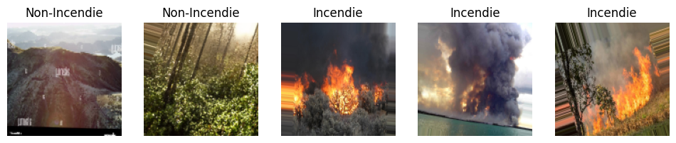
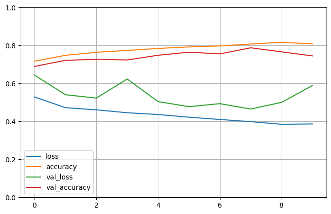
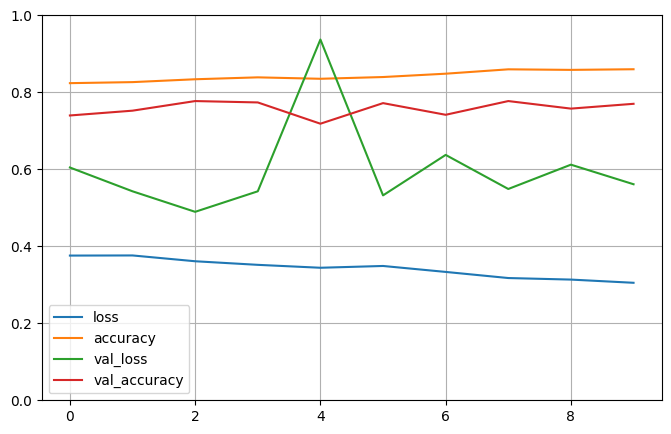

<h1> Classification d'images d'incendies</h1>

### BOUEDO THEO
**Date :** 18/12/2023

&nbsp;

&nbsp;
### Table of Contents
[**I. Introduction**](#i-introduction) 

[**II. Gestion & analyse de la base**](#ii-gestion--analyse-de-la-base) 
&nbsp;&nbsp;&nbsp;&nbsp;[A. Importation et nettoyage](#a-importation-et-nettoyage) 
&nbsp;&nbsp;&nbsp;&nbsp;[B. Analyse et transformation](#b-analyse-et-transformation) 

[**III. Évaluation de Modèles et optimisation**](#iii-évaluation-de-modèles-et-optimisation) 
&nbsp;&nbsp;&nbsp;&nbsp;[A. Modèle CNN](#a-modèle-cnn) 
&nbsp;&nbsp;&nbsp;&nbsp;[B. Modèle CNN avec CLAHE](#b-modèle-cnn-avec-clahe) 
&nbsp;&nbsp;&nbsp;&nbsp;[C. Modèle CNN avec transfert d'apprentissage](#c-modèle-cnn-avec-transfert-dapprentissage) 
&nbsp;&nbsp;&nbsp;&nbsp;[D. Modèle SVM](#d-modèle-svm) 
&nbsp;&nbsp;&nbsp;&nbsp;[E. Optimisation](#e-optimisation) 

[**IV. Conclusion / Discussion**](#iv-conclusion--discussion) 

## I. Introduction
L'analyse d'image par intelligence artificielle est un domaine en pleine expansion, particulièrement dans la détection d'événements critiques tels que les incendies. Dans ce projet, nous avons exploré l'efficacité des réseaux de neurones convolutifs (CNN) pour identifier la présence d'incendie dans des images. Nous avons testé quatre approches différentes : un modèle CNN standard, un CNN combiné avec l'Algorithme de CLAHE pour l'amélioration du contraste, un CNN amélioré par transfert d'apprentissage et enfin, une approche basée sur une Machine à Vecteurs de Support (SVM) pour la classification après l'extraction des caractéristiques. L'objectif principal était de déterminer si chaque image analysée représentait un incendie, en exploitant la puissance du traitement d'image et de l'apprentissage automatique.

## II. Gestion & analyse de la base
### A. Importation et nettoyage
####  Importation

Le jeu de données utilisé pour ce projet a été obtenu depuis le site de Hugging Face, accessible via le lien suivant : https://huggingface.co/datasets/pyronear/openfire. Initialement, ce jeu de données se compose de deux ensembles distincts : un ensemble d'entraînement (train) et un ensemble de validation (validation), chacun comprenant une colonne avec l'URL des images et une autre indiquant par un booléen (`is_wildfire`) si l'image représente un incendie ou non.

La première étape du projet consistait à télécharger ces images, tâche réalisée à l'aide de la bibliothèque `requests`. Les deux ensembles de données comprenaient à l'origine environ 8000 URL d'images, et le processus de téléchargement a duré près de 2 heures.

Pour différencier les images appartenant aux ensembles d'entraînement et de validation, ainsi que celles représentant des incendies de celles qui n'en représentent pas, le projet a suivi l'architecture présentée dans l'image ci-dessous.

#### Suppression des images corrompues
Des problèmes ont été rencontrés lors de la phase de téléchargement, notamment la disparition de certains liens, rendant impossible le téléchargement de certaines images, ainsi que la présence d'images corrompues. Une fonction spécifique a été développée pour détecter et supprimer ces images corrompues des dossiers du projet.

### B. Analyse et transformation

#### Analyse
En raison de la disparition de certains liens et de la présence d'images corrompues, une proportion significative des images a été retirée, résultant en une différence notable entre le dataset initial et le dataset final. La `Table 1` illustre cette évolution, offrant un aperçu détaillé de la distribution des datasets d'entraînement et de validation, ainsi que de la classification des images en 'incendie' et 'non-incendie'.

Nous observons qu'entre les datasets initiaux et finaux, il y a eu une perte de 20 à 25% du volume total d'images. Cette diminution est uniforme, affectant de manière équivalente les deux ensembles de données et les deux catégories d'images.

Quant à la répartition entre les images représentant des incendies et celles n'en représentant pas, le ratio final de 65% pour les images 'non-incendie' contre 35% pour celles 'incendie' est intéressant.

En ce qui concerne la répartition entre les ensembles d'entraînement et de validation, avec un peu plus de 10% des images allouées à la validation, ce ratio est conforme aux recommandations standards en data science. 

#### Table 1 : Comparaison des ensembles de données initiaux et finaux pour la détection d'incendie
|                  | DATASET INITIAL |                | DATASET FINAL   |                |
|------------------|-----------------|----------------|-----------------|----------------|
| Dataset          | Train           | Validation     | Train           | Validation     |
| Incendie         | 2518            | 279            | 1981            | 229            |
| Non-Incendie     | 4625            | 513            | 3444            | 425            |
| Total            | 7143            | 792            | 5425            | 654            |
| % Incendie       | 35.25          | 35.23         | 36.52          | 35.02         |
| % Non-Incendie   | 64.75          | 64.77         | 63.48          | 64.98         |

#### Transformation

Lors de l'examen des images, nous avons remarqué une variabilité dans leurs dimensions. Pour uniformiser ces différences, une transformation a été appliquée pour `redimensionner` toutes les images à une taille commune de `128x128`. Ce choix de dimension a été guidé par le fait que des images de grande taille augmentent le temps de calcul.

Pour enrichir notre ensemble de données, nous avons utilisé `ImageDataGenerator` de la bibliothèque `keras.preprocessing.image`. L'objectif principal de cette démarche est de créer une variété d'exemples d'apprentissage pour renforcer la capacité du modèle à généraliser. Cette technique est pertinente car elle permet au modèle de s'habituer à diverses transformations que les images peuvent subir dans des situations réelles.

L'utilisation de la fonctionnalité `rescale` est importante car elle `normalise` les valeurs des pixels, les amenant dans un intervalle compris entre 0 et 1, ce qui est optimal pour le traitement par les modèles d'apprentissage profond. De plus, l'application de `rotations, de zooms et de décalages aléatoires` simule différentes perspectives et échelles que les images pourraient présenter, ce qui contribue à renforcer la `robustesse` du modèle face à des variations inattendues dans les données d'entrée.

En résumé, `ImageDataGenerator` ne se limite pas à augmenter le volume des données, mais améliore également la qualité de l'apprentissage en exposant le modèle à un large éventail de variations possibles des images.

## III. Évaluation de Modèles

Pour nos modèles de réseaux de neurones convolutifs (CNN), nous avons systématiquement fixé le nombre d'époques à 10 en raison des contraintes de temps de calcul.  Nous n'avons pas procédé à un ajustement fin des hyperparamètres pour ces modèles (CNN et SVM), cependant, il est important de noter que nous avons inclus des étapes d'optimisation dans le notebook pour démontrer la procédure, même si ces étapes n'ont pas été poussées à leur terme pour les raisons mentionnées.

### A. Modèle CNN 

Un Convolutional Neural Network (CNN) est une forme avancée de réseau de neurones artificiels, très utilisé dans le traitement et l'analyse d'images. À la base, un CNN partage des éléments fondamentaux avec les réseaux de neurones classiques. Comme ces derniers, un CNN est composé de neurones qui possèdent des poids et des biais pouvant être ajustés au cours de l'apprentissage. Chaque neurone reçoit des entrées, réalise un produit scalaire suivi d'une fonction d'activation, permettant au réseau de traiter et de transmettre des informations. Cependant, pour les CNN, l'architecture se distingue par l'intégration de couches de convolution et de pooling spécifiques. Ces couches permettent l'extraction et le traitement efficace des caractéristiques spatiales, comme les bords et les textures dans les images.

Dans un scénario de classification d'images, comme pour déterminer si une image contient un incendie ou non, un CNN peut être particulièrement intéressant. Lors de l'entraînement, le réseau apprend à identifier et à différencier les caractéristiques spécifiques d'images contenant un incendie (comme les flammes, la fumée, les couleurs vives) de celles qui n'en contiennent pas. Ainsi, une fois entraîné, le CNN peut analyser une nouvelle image et déterminer avec une certaine précision si elle représente un incendie. Ce processus se réalise grâce à la succession des différentes couches de convolution qui extraient et analysent les caractéristiques, suivies de couches de pooling qui réduisent la dimensionnalité de l'image, et enfin de couches entièrement connectées qui classifient l'image en fonction des caractéristiques extraites.

Afin de fournir une compréhension claire et structurée de notre modèle de détection d'incendie, nous avons résumé ses caractéristiques principales dans la table ci dessous.
 
#### Table 2 : Paramètres du Modèle de Détection d'Incendie CNN

| Couche             | Filtres | Taille du filtre | Activation | Input Shape       | Opération        |
|--------------------|---------|------------------|------------|-------------------|------------------|
| Conv2D (couche 1)  | 16      | 3 x 3            | ReLU       | (128, 128, 3)     | Convolution      |
| MaxPooling2D (1)   | -       | 2 x 2            | -          | -                 | Max Pooling      |
| Conv2D (couche 2)  | 32      | 3 x 3            | ReLU       | -                 | Convolution      |
| MaxPooling2D (2)   | -       | 2 x 2            | -          | -                 | Max Pooling      |
| Conv2D (couche 3)  | 64      | 3 x 3            | ReLU       | -                 | Convolution      |
| MaxPooling2D (3)   | -       | 2 x 2            | -          | -                 | Max Pooling      |
| Flatten            | -       | -                | -          | -                 | Aplatir          |
| Dense (couche 4)   | -       | -                | ReLU       | -                 | Couche Complètement Connectée |
| Dense (couche 5)   | -       | -                | Sigmoid    | -                 | Couche de Sortie |

&nbsp;

Notre modèle de détection d'incendie utilise des couches `Conv2D` pour capturer une gamme de caractéristiques visuelles à partir d'images, en commençant par des éléments simples comme les bords et les textures à des détails plus complexes grâce à l'augmentation du nombre de filtres de 16 à 64 à travers les couches successives. La fonction d'activation ReLU accompagne chaque couche convolutive pour apporter la non-linéarité nécessaire, permettant ainsi au modèle d'apprendre des motifs visuels plus complexes inhérents aux images d'incendie. 

Les couches `MaxPooling2D` interviennent pour réduire les dimensions des caractéristiques apprises, ce qui aide à minimiser le surajustement et permet au modèle d'être robuste face à la variabilité de la position et de l'échelle des incendies dans différentes images. Après les couches de convolution et de pooling, la fonction `Flatten` transforme les caractéristiques en un vecteur unique pour faciliter la classification par les couches denses suivantes, qui synthétisent ces caractéristiques en informations de haut niveau. En fin de compte, la couche de sortie utilise une ``activation sigmoïde`` pour prédire la probabilité qu'une image donnée contienne un incendie, fournissant ainsi une classification binaire claire.

#### Figure 1 : Évolution de la perte et de la précision durant l'entraînement et la validation du CNN

Le graphique ci-dessus révèle un modèle CNN qui démontre une amélioration graduelle de la précision d'entraînement, avec un accroissement de celle-ci d'environ 80% à 85% au cours des époques, ce qui témoigne d'une capacité accrue à classer avec exactitude les images d'incendie dans l'ensemble d'entraînement. Concernant l'ensemble de validation, la précision atteint un sommet de près de 78% avant de connaître des variations, reflétant une certaine instabilité dans la généralisation du modèle. Bien que l'on observe une volatilité dans la précision et une légère remontée de la perte de validation à un moment donné, ces indicateurs ne sont pas nécessairement synonymes d'un surajustement marqué. Le modèle semble conserver une performance de généralisation adéquate jusqu'à la neuvième époque, avec une précision de validation au-dessus de 81%. 

### B. Modèle CNN avec CLAHE

`CLAHE` est une méthode d'ajustement du contraste qui affine de manière ciblée l'éclairage dans des zones spécifiques d'une image, un avantage notable pour mettre en évidence les détails dans des régions sombres ou inégalement éclairées, comme on peut en rencontrer dans les images d'incendie. Une image en couleur se compose de trois canaux principaux — rouge, vert et bleu (RGB) — qui, combinés, forment la gamme complète des couleurs perçues. Dans notre cas, nous avons appliqué CLAHE uniquement sur le canal de luminance (L), et non sur les canaux de couleur. Cette approche se concentre sur l'amélioration de la visibilité des structures et formes en améliorant le contraste, tout en préservant les informations de couleur originales, ce qui est crucial pour identifier avec précision les incendies dans les images où la luminosité peut être  un indicateur clé.

Concernant les paramètres du modèle, nous avons garder les mêmes que le modèle précédent.

#### Figure 2 :  Évolution de la perte et de la précision durant l'entraînement et la validation du CNN avec CLAHE

A travers le graphique ci dessus nous constatons que le modèle CNN avec CLAHE présente une précision d'entraînement qui s'améliore de manière constante, ce qui laisse penser à un affinement dans la reconnaissance des images d'incendie. Toutefois, la précision de validation pour ce modèle se stabilise autour de 0.77, ce qui est légèrement inférieur à la précision de validation proche de 0.81 observée pour le modèle CNN sans CLAHE. Bien que l'application de CLAHE ait potentiellement réduit la volatilité de la précision de validation, cela ne s'est pas traduit par une augmentation significative de la précision globale sur l'ensemble de validation dans ce cas précis. 

### C. Modèle CNN avec transfert d'apprentissage

Le principe du transfert d'apprentissage repose sur l'idée que les connaissances acquises par un modèle lors de l'apprentissage d'une tâche peuvent être transférées et réutilisées pour une autre tâche connexe. C'est une approche puissante en apprentissage profond, car elle permet d'exploiter des modèles préalablement entraînés sur de vastes ensembles de données, comme ImageNet, qui ont déjà appris à identifier des caractéristiques et des motifs visuels complexes. Ce processus est avantageux car il évite de repartir de zéro pour l'apprentissage, ce qui nécessiterait des ressources considérables en termes de données, de temps et de puissance de calcul.

Les avantages du transfert d'apprentissage sont multiples. Il offre une amélioration significative du temps d'entraînement puisque le modèle initial a déjà une connaissance préliminaire des caractéristiques générales des images. De plus, il peut aussi améliorer la performance du modèle sur la nouvelle tâche, surtout lorsque les données disponibles sont limitées ou lorsque l'on dispose de moyens de calcul restreints.

Dans notre cas spécifique, nous avons choisi d'implémenter le transfert d'apprentissage avec EfficientNetB0 pour notre projet de détection d'incendie. Ce modèle est reconnu pour son efficacité, capable de fournir de bons résultats tout en étant moins gourmand en ressources de calcul que d'autres architectures. Malgré le fait qu'EfficientNetB0 a été entraîné sur des images de résolution plus élevée (224x224 pixels), nous avons décidé de conserver une résolution de 128x128 pixels pour garder la même résolution entre les modèles afin de les comparer. 

*Ps : On aurait aimé tester tous les modèles en résolution 224x224 pour évaluer pleinement le potentiel de cette méthode, mais la réexécution des modèles étant déjà assez chronophage, environ 1 heure par modèle, nous avons pas entrepris cette démarche.*

#### Figure 3 : Évolution de la perte et de la précision durant l'entraînement et la validation du CNN avec EfficientNetB0

La stabilité de la précision du modèle est comparable à celle observée avec l'utilisation de CLAHE, avoisinant les 0.77. Cependant, à la différence des autres modèles, celui-ci montre une progression moindre et un écart plus marqué entre la précision d'entraînement et de validation, indiquant un surajustement plus prononcé que dans les cas précédents.

### D. Modèle SVM

L'approche SVM (Support Vector Machine) pour l'analyse d'images se distingue considérablement de celle employée par les réseaux de neurones convolutifs (CNN). Alors que les CNN sont des modèles d'apprentissage profond spécifiquement conçus pour traiter et apprendre directement à partir des données brutes d'images, les SVM sont des modèles d'apprentissage supervisé plus traditionnels qui ne traitent pas directement les données d'image en tant que telles. Au lieu de cela, les SVM nécessitent un ensemble de caractéristiques pré-extraites pour fonctionner efficacement.

L'approche SVM repose sur la recherche d'un hyperplan qui sépare au mieux les différentes classes dans un espace de caractéristiques à haute dimension. Dans le contexte de l'analyse d'image, cela signifie que chaque image est transformée en un vecteur de caractéristiques avant d'être introduite dans le modèle SVM. Les caractéristiques peuvent inclure des détails sur la texture, les bords, les couleurs ou d'autres descripteurs calculés à partir de l'image. Une fois ces caractéristiques extraites et aplaties en vecteurs, comme le démontre le code fourni, elles servent d'entrée au SVM pour l'entraînement et la classification.

Suite à l'extraction des caractéristiques, nous avons procédé à la standardisation des données et à l'entraînement de notre modèle sur l'ensemble de données d'entraînement. L'objectif était d'évaluer la précision du modèle sur l'ensemble de validation. En utilisant un modèle sans ajustement fin des hyperparamètres, nous avons atteint une précision de 0.74.

### E. Optimisation

Dans ce contexte, l'aspect le plus crucial est le coût et le temps nécessaires pour le calcul. Utilisant une configuration standard accessible à la plupart des utilisateurs, l'entraînement des modèles de réseaux de neurones convolutionnels (CNN) mentionnés ci-dessus prenait approximativement 100 minutes. Pour optimiser cela, le nombre d'images utilisées pour l'entraînement a été limité à 1 000 et à 200 pour la validation, réduisant ainsi le volume d'images de 80%. Cette modification a significativement diminué le temps de calcul pour le modèle CNN, le faisant passer de 100 minutes à seulement 7 minutes.

Pour l'optimisation des hyperparamètres, deux méthodes sont généralement utilisées : `RandomSearch` et `GridSearch`.

`RandomSearch` sélectionne aléatoirement des combinaisons d'hyperparamètres à tester, ce qui est plus rapide et souvent plus efficace que de tester toutes les combinaisons possibles, surtout quand l'espace des hyperparamètres est grand. Cependant, il pourrait manquer la combinaison optimale puisque la recherche est aléatoire. `GridSearch`, en revanche, teste systématiquement toutes les combinaisons possibles d'hyperparamètres dans la grille définie. Cela garantit de trouver la meilleure combinaison, mais peut être très lent et coûteux en termes de calcul, surtout avec un grand nombre d'hyperparamètres. En résumé, RandomSearch est préférable pour un aperçu rapide et efficace, tandis que GridSearch convient mieux quand la précision de la sélection des hyperparamètres est cruciale et que le temps de calcul n'est pas une contrainte majeure.

Dans cet exercice, nous avons appliqué la méthode RandomSearch pour ajuster les paramètres du modèle CNN et la méthode GridSearch pour le modèle SVM. Ces techniques nous ont permis d'optimiser les paramètres clés de ces modèles. Cependant, il est important de noter que l'optimisation peut devenir bien plus complexe. Cette complexité provient de plusieurs facteurs, tels que la diversité des hyperparamètres, les interactions entre eux, et la nécessité de trouver un équilibre entre précision du modèle et risque de surajustement. En outre, une contrainte majeure demeure le coût de calcul : plus l'optimisation est poussée, plus les ressources computationnelles requises augmentent.

#### i. CNN

#### Synthèse des Résultats de l'Optimisation des Hyperparamètres du Modèle CNN

| Trial | Optimizer | Learning Rate | Input Units | Dense Units | Validation Accuracy |
|-------|-----------|---------------|-------------|-------------|---------------------|
| 1     | SGD       | 0.009476      | 192         | 32          | 0.748571            |
| 2     | Adam      | 0.000649      | 64          | 96          | 0.731429            |
| 3     | SGD       | 0.000296      | 160         | 64          | 0.640000            |
| 4     | SGD       | 0.000640      | 192         | 32          | 0.634286            |
| 5     | Adam      | 0.006591      | 128         | 128         | 0.571429            |

En analysant le tableau, on peut observer comment différents hyperparamètres affectent la précision de validation du modèle :

`Optimizer`: L'optimiseur joue un rôle essentiel dans l'apprentissage des modèles, influençant leur mise à jour et la convergence vers un minimum de la fonction de perte. Le tableau montre des performances variables entre les essais utilisant SGD (Stochastic Gradient Descent) et Adam (Adaptive Moment Estimation). SGD, simple et rapide, est efficace pour des problèmes moins complexes, tandis qu'Adam, combinant des techniques de momentum et d'ajustement adaptatif du taux d'apprentissage, est souvent préféré pour des tâches plus complexes grâce à sa stabilité et son adaptation aux données. Bien que le Trial 1 avec SGD montre la meilleure précision, cela ne prouve pas sa supériorité absolue sur Adam, car l'efficacité de l'optimiseur dépend fortement des spécificités du modèle et des autres hyperparamètres.

` Learning rate` : Le taux d'apprentissage détermine l'ampleur des mises à jour des poids du modèle à chaque étape de l'entraînement. Un taux trop élevé peut conduire à un apprentissage instable, tandis qu'un taux trop bas peut ralentir le processus d'apprentissage ou entraîner une convergence vers un minimum local. Le Trial 1 a un taux d'apprentissage relativement élevé pour SGD et obtient de bons résultats, mais cela varie avec la combinaison des autres hyperparamètres.

`Input Units et Dense Units` : Ces paramètres définissent le nombre d'unités dans les couches convolutive et dense, respectivement. Ils influencent la capacité du modèle à apprendre des caractéristiques complexes. Un nombre élevé d'unités peut améliorer la capacité du modèle à apprendre, mais peut aussi entraîner un surapprentissage et augmenter le temps de calcul. Par exemple, le Trial 5, avec un grand nombre d'unités denses (128), a la plus faible précision, ce qui pourrait indiquer un surajustement ou une complexité excessive pour les données en question

En conclusion, ce tableau démontre l'importance cruciale du choix et de la combinaison des hyperparamètres dans la performance des modèles de machine learning. Les variations observées dans la précision de validation soulignent que l'équilibre optimal entre l'optimiseur, le taux d'apprentissage et la configuration des couches est essentiel pour atteindre une efficacité maximale, sans tomber dans le surapprentissage ou l'insuffisance d'apprentissage

#### ii. SVM

#### Synthèse des Résultats de l'Optimisation des Hyperparamètres du Modèle SVM

| param_svm__C | param_svm__kernel | mean_test_score |
|--------------|-------------------|-----------------|
| 1            | rbf               | 0.749719        |
| 1            | linear            | 0.635241        |
| 1            | poly              | 0.686869        |
| 10           | rbf               | 0.727273        |
| 10           | linear            | 0.635241        |
| 10           | poly              | 0.661055        |
| 100          | rbf               | 0.707071        |
| 100          | linear            | 0.635241        |
| 100          | poly              | 0.644220        |

En examinant le tableau des résultats de GridSearchCV pour le modèle SVM, voici une interprétation des effets des hyperparamètres sur la performance du modèle 

``Paramètre C :`` Le paramètre C est un facteur de régularisation dans le SVM qui contrôle le compromis entre un modèle simple et un ajustement précis aux données d'entraînement. Des valeurs plus élevées de C tendent à favoriser un ajustement précis, mais peuvent conduire à un surapprentissage, tandis que des valeurs plus faibles favorisent un modèle plus simple et généralisable.
Dans ce tableau, C=1 donne les meilleurs résultats avec le noyau RBF, indiquant un équilibre efficace entre ajustement et régularisation. Augmenter C à 10 ou 100 n'améliore pas significativement les performances, suggérant qu'une régularisation accrue ne bénéficie pas nécessairement au modèle.

``Type de noyau ``: Les noyaux rbf, linear, et poly montrent des performances différentes, reflétant leur capacité à modéliser des relations dans les données.
Le noyau rbf semble être le plus efficace, surtout avec C=1, indiquant sa capacité à capturer les relations non linéaires complexes dans les données. Cela peut être particulièrement bénéfique pour les tâches de classification d'images où les relations entre les pixels ne sont pas linéaires.
Les noyaux linear et poly montrent des performances inférieures dans cet ensemble de données. Cela pourrait signifier que les relations linéaires ou polynomiales simples ne sont pas suffisantes pour capturer la complexité des données d'image pour la classification d'incendie.

En conclusion, ce tableau met en lumière l'importance de choisir le bon noyau et le bon niveau de régularisation pour maximiser la performance du modèle SVM, particulièrement dans des tâches complexes comme la classification d'images. Le noyau RBF avec un paramètre de régularisation modéré semble être le choix optimal.

## IV. Conclusion / Discussion
#### Tableau résumé
| Modèles        | Accuracy |
|----------------|----------|
| CNN            | 0.81     |
| CNN CLAHE      | 0.77     |
| EfficientNetB0 | 0.77     |
| SVM            | 0.74     |

En conclusion, le modèle CNN traditionnel s'est révélé être le plus efficace avec une précision (accuracy) de 0.81, un résultat remarquable étant donné les limitations en termes de ressources de calcul. Nous avons identifié des aspects à améliorer, comme la concentration principale sur l'accuracy malgré une répartition non équitable des images entre incendie et non incendie. Une réajustement de la répartition des images ou l'utilisation de métriques supplémentaires comme la précision, le rappel, et le F1-score aurait été idéale pour une meilleure évaluation. De même, il aurait été plus judicieux de réaliser d'abord de l'optimisation sur un petit jeu de données pour affiner les hyperparamètres, puis de l'étendre à un ensemble de données plus large pour valider ces choix. Cependant, ces ajustements nécessitaient de refaire l'ensemble des calculs, une tâche considérablement chronophage étant donné nos ressources limitées. Ainsi, ces changements n'ont pas été réalisés pour éviter un allongement significatif du temps de projet.

Enfin, ce projet a néanmoins établi une base solide pour l'analyse et la classification d'images. Les limitations, principalement les longs temps de traitement, auraient pu être surmontées avec des ressources de calcul plus importantes, comme celles offertes par le cloud. Cette expérience s'est révélée être une opportunité d'apprentissage précieuse, montrant que des ressources adéquates peuvent améliorer significativement les performances et les résultats.

